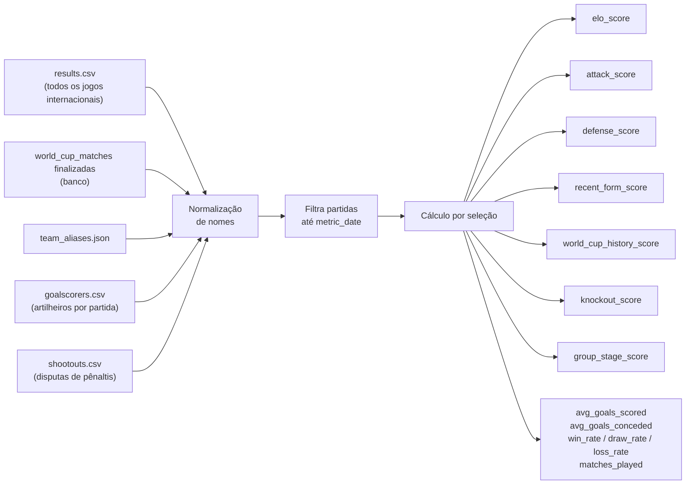
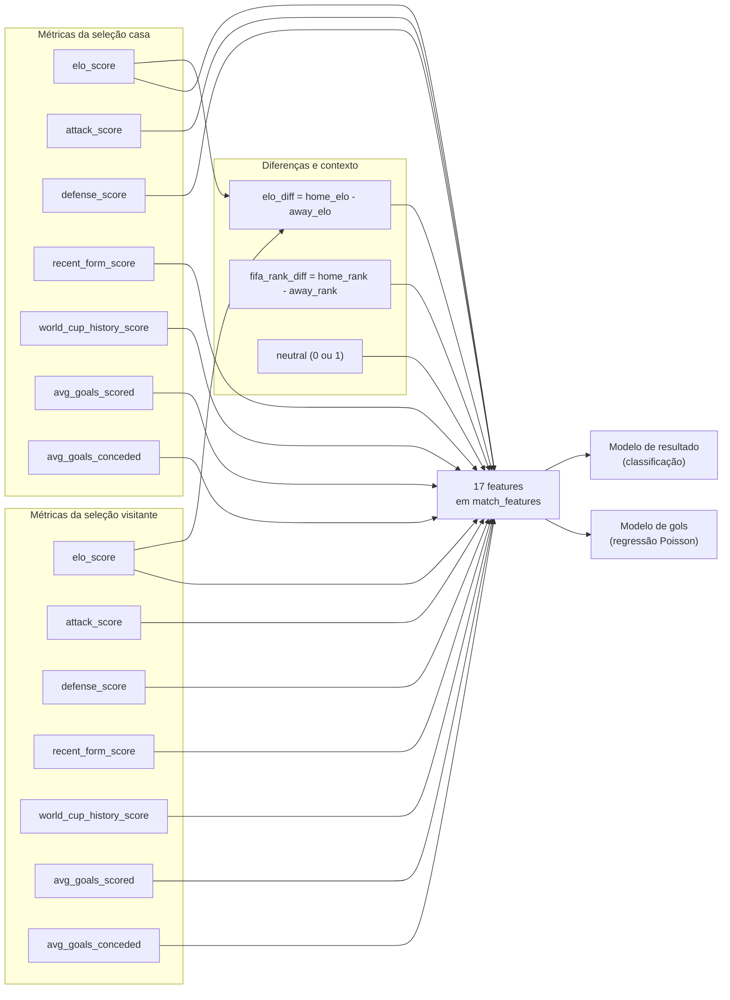

# ML Service — Métricas das Seleções

Documentação detalhada de todas as métricas calculadas por seleção, incluindo fórmulas, janelas temporais e como são usadas como features nos modelos.

---

## Visão geral

As métricas são calculadas no script `calculate_team_metrics.py` e salvas em `team_metrics`. Elas representam o estado de cada seleção em uma data específica (`metric_date`), usando apenas partidas disputadas antes dessa data — sem vazamento de informação futura.



---

## 1. ELO Score

**O que mede:** força relativa da seleção com base no histórico completo de resultados, pesando mais vitórias em torneios importantes.

**Cálculo:**
```
rating_inicial = 1500.0

para cada partida (ordem cronológica):
  expected = 1 / (1 + 10^((rating_oponente - rating_time) / 400))
  
  goal_multiplier = min(1.75,  1 + log(|gol_diff|) / 3)
    → vitória por 1: multiplier ≈ 1.0
    → vitória por 2: multiplier ≈ 1.23
    → vitória por 4: multiplier ≈ 1.46

  k_factor por torneio:
    FIFA World Cup              → 40.0
    Continental (Euro, Copa América, etc.) → 30.0
    Outros                      → 20.0

  novo_rating = rating + k_factor × goal_multiplier × (resultado - expected)
    resultado: vitória=1.0, empate=0.5, derrota=0.0
```

**Escala:** livre, tipicamente entre 1200 e 1900 para seleções participantes da Copa.

---

## 2. Attack Score

**O que mede:** força ofensiva composta, combinando múltiplos indicadores de poder de ataque.

**Fórmula:**
```
attack_score = (
  0.30 × historical_goals_norm +
  0.30 × recent_goals_norm     +
  0.15 × world_cup_norm        +
  0.15 × scorer_depth_norm     +
  0.10 × penalty_independence_norm
) × 100
```

**Componentes:**

| Componente | Peso | Como calcula |
| --- | --- | --- |
| `historical_goals_norm` | 30% | Média histórica de gols marcados, normalizada no range [0.0, 3.0] |
| `recent_goals_norm` | 30% | Média de gols nas últimas 10 partidas, normalizada em [0.0, 3.0] |
| `world_cup_norm` | 15% | Média de gols em Copas do Mundo, normalizada em [0.0, 3.0] |
| `scorer_depth_norm` | 15% | Profundidade de artilharia: `unique_scorers / total_goals`, range [0.05, 0.45] |
| `penalty_independence_norm` | 10% | `100 - penalty_share_norm` — punição por depender demais de pênaltis |

**Escala:** 0–100.

---

## 3. Defense Score

**O que mede:** solidez defensiva, combinando gols sofridos e clean sheets.

**Fórmula:**
```
defense_score = (
  0.45 × (100 - conceded_norm)        +
  0.35 × (100 - recent_conceded_norm) +
  0.20 × clean_sheet_rate × 100
) 
```

**Componentes:**

| Componente | Peso | Como calcula |
| --- | --- | --- |
| `conceded_norm` | 45% | Média histórica de gols sofridos normalizada em [0.0, 3.0], invertida |
| `recent_conceded_norm` | 35% | Média de gols sofridos nas últimas 10 partidas, normalizada, invertida |
| `clean_sheet_rate` | 20% | Proporção de jogos sem sofrer gol (× 100 para escalar) |

**Escala:** 0–100. Valores altos = defesa sólida.

---

## 4. Recent Form Score

**O que mede:** desempenho das últimas 10 partidas, com peso maior para jogos mais recentes.

**Cálculo:**
```
janela = últimas 10 partidas antes de metric_date

para cada partida i (mais antiga → mais recente):
  peso_i = i / n           (ex: jogo mais recente tem peso 10/10 = 1.0)
  ponto_i = vitória → 3, empate → 1, derrota → 0

forma = Σ(ponto_i × peso_i) / Σ(peso_i × 3)  × 100
```

**Escala:** 0–100. Vitórias consecutivas recentes = score alto.

---

## 5. World Cup History Score

**O que mede:** histórico de desempenho específico em Copas do Mundo, com maior peso para torneios recentes.

**Cálculo:**
```
filtra somente partidas de Copas do Mundo

para cada torneio (mais recente → mais antigo):
  decay = max(0, 1 - anos_atrás / 16)   (torneiros > 16 anos atrás têm decay=0)
  
  pontos_torneio = Σ(resultado × decay) por cada partida do torneio
  max_pontos_torneio = n_partidas × decay × 3

score = Σ pontos_torneio / Σ max_pontos_torneio × 100
```

**Escala:** 0–100. Seleções com histórico forte na Copa (especialmente recente) têm score alto.

---

## 6. Knockout Score

**O que mede:** desempenho em fases eliminatórias e disputas de pênaltis.

**Fórmula:**
```
knockout_score = 0.75 × knockout_stage_score + 0.25 × shootout_score

knockout_stage_score = vitórias_em_knockouts / total_jogos_knockout  × 100
shootout_score       = vitórias_em_pênaltis / total_disputas_pênaltis × 100
                       (0 se nunca disputou)
```

**Escala:** 0–100.

---

## 7. Group Stage Score

**O que mede:** aproveitamento em fase de grupos.

**Cálculo:**
```
group_stage_score = vitórias_em_grupos / total_jogos_em_grupos × 100
```

**Escala:** 0–100.

---

## 8. Métricas brutas

Calculadas diretamente dos dados históricos, sem normalização:

| Métrica | Cálculo |
| --- | --- |
| `avg_goals_scored` | total_gols_marcados / total_partidas |
| `avg_goals_conceded` | total_gols_sofridos / total_partidas |
| `win_rate` | vitórias / total_partidas |
| `draw_rate` | empates / total_partidas |
| `loss_rate` | derrotas / total_partidas |
| `matches_played` | total de partidas no histórico |

---

## Features dos modelos

As métricas de cada seleção são combinadas para formar as 17 features de cada partida em `match_features`:



### Lista completa das 17 features

| Feature | Tipo | Descrição |
| --- | --- | --- |
| `elo_diff` | diferença | `home_elo_score - away_elo_score` |
| `fifa_rank_diff` | diferença | `home_fifa_rank - away_fifa_rank` |
| `home_elo_score` | métrica | ELO atual da seleção casa |
| `away_elo_score` | métrica | ELO atual da seleção visitante |
| `home_attack_score` | métrica | Força ofensiva da casa (0–100) |
| `away_attack_score` | métrica | Força ofensiva do visitante (0–100) |
| `home_defense_score` | métrica | Solidez defensiva da casa (0–100) |
| `away_defense_score` | métrica | Solidez defensiva do visitante (0–100) |
| `home_recent_form_score` | métrica | Forma recente da casa — últimas 10 partidas (0–100) |
| `away_recent_form_score` | métrica | Forma recente do visitante — últimas 10 partidas (0–100) |
| `home_avg_goals_scored` | métrica | Média histórica de gols marcados pela casa |
| `away_avg_goals_scored` | métrica | Média histórica de gols marcados pelo visitante |
| `home_avg_goals_conceded` | métrica | Média histórica de gols sofridos pela casa |
| `away_avg_goals_conceded` | métrica | Média histórica de gols sofridos pelo visitante |
| `home_world_cup_history_score` | métrica | Histórico da casa em Copas (0–100) |
| `away_world_cup_history_score` | métrica | Histórico do visitante em Copas (0–100) |
| `neutral` | contexto | 1 se campo neutro, 0 caso contrário |

> **Importante:** `home_score` e `away_score` nunca entram como features. Os modelos só usam informação pré-jogo para não vazar resultado.

---

## Snapshots de métricas

Além das métricas agregadas em `team_metrics`, o pipeline salva snapshots detalhados em `team_metric_snapshots` com os componentes brutos que compõem cada score composto (ex: `scorer_depth_score`, `penalty_independence_score`, `clean_sheet_rate`). Esses snapshots permitem auditoria e análise de quais componentes mais influenciam cada seleção.
